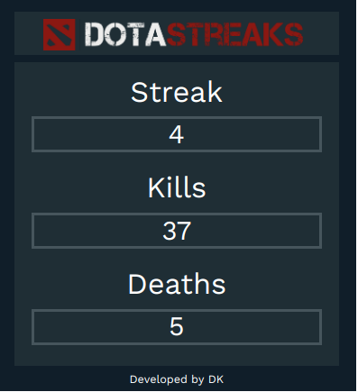

# DotaStreaks

## What is DotaStreaks?

DotaStreaks is one of the first Twitch extensions released. 
It displays a custom set of statistics for the last streak of wins of the user. 
 

## Technical features

- Golang back-end server
- JWT processing
- Dota API data sync
- Twitch Extension API integration
